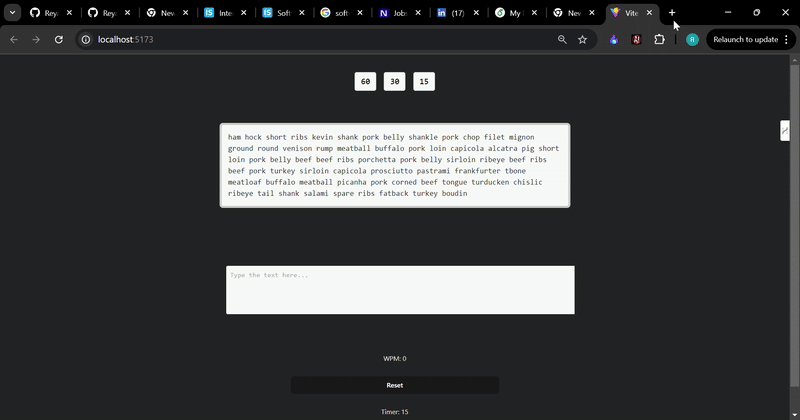

# WordSprint  

WordSprint is a typing speed test application inspired by MonkeyType. I aimed to replicate its simple design and the smooth typing experience it provides.  

## Features  
- **Timer Options** – Choose between **60, 30, or 15 seconds** for your typing session.  
- **Reset Button** – Quickly reset the application to start a new session.  
- **Typing Box** – Start typing when the timer begins; once time runs out, the input is disabled, and your **WPM (Words Per Minute)** is displayed.  

## Tech Stack  
- **Frontend**: HTML, CSS, JavaScript, React  
- **State Management**: Redux (React-Redux)  

## Experience & Learning  
At first, this project seemed simple, but it actually took me **over two weeks** to complete! Managing state was a real challenge, especially handling communication between different components. However, I learned a lot about **state management** and implemented the **Container-Presenter pattern**, which really helped in organizing the code and debugging issues.  

## Running Locally  
To run the project on your system:  

1. Make sure you have **Node.js** installed.  
2. Install dependencies:  
   ```sh
   npm install
   ```  
3. Start the development server:  
   ```sh
   npm run dev
   ```  

## Live Demo  
[Live Project Link](https://word-sprint-rho.vercel.app/)   

## Demo Video  

